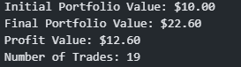

# Maverick RSI Strategy

Maverick RSI Strategy is a simple automated trading strategy based on the Relative Strength Index (RSI) indicator. It uses the MetaTrader 5 platform to retrieve historical price data, calculate the RSI, and execute sell trades when specific conditions are met.

## Project Structure

The project is organized into several directories:

- `Backtest`: Contains the Jupyter notebook `backtest.ipynb`, which performs backtesting on the Maverick RSI Strategy using historical data and showcases the results in the form of images.
- `Documentation`: Contains the Jupyter notebook `maverick.ipynb`, which provides detailed documentation and explanations for the Maverick RSI Strategy.
- `Obsolete`: Contains older versions of the strategy script (`maverick_rsi_v1.py` and `maverick_rsi_v2.py`) that are no longer in use.
- `Source`: Contains auxiliary files used in the project, including ASCII art, backtest result images, sounds, and the `requirements.txt` file.
- `Strategy`: Contains the main implementation of the Maverick RSI Strategy in the `maverick_v3.py` script, along with a `tools` directory that houses the `print_utils.py` module for improved code readability.

## Documentation

The `Documentation` directory contains the `maverick.ipynb` Jupyter notebook, which serves as comprehensive documentation for the Maverick RSI Strategy. The notebook includes detailed explanations of the strategy's components, such as data retrieval, RSI calculation, and trade execution. It also provides insights into the trading logic and considerations for the strategy's implementation.

## Obsolete

The `Obsolete` directory houses older versions of the strategy script that are no longer in use or have been superseded by newer versions. These scripts are preserved for historical reference and should not be utilized in the current implementation.

## Source

The `Source` directory contains auxiliary files used in the project:

- `image`: Contains backtest result images, including `backtest.png` and `profit.png`.
- `son`: Contains sound files used for notifications, including `error.mp3` and `success.mp3`.
- `text`: Contains ASCII art used for decorative purposes in `ascii.txt` and the `requirements.txt` file listing the required Python packages and their versions to run the Maverick RSI Strategy. You can install these dependencies using `pip` with the command `pip install -r Source/text/requirements.txt`.

## Strategy

The `Strategy` directory is the core of the Maverick RSI Strategy:

- `maverick_v3.py`: This script contains the main implementation of the strategy. It retrieves historical price data, calculates the RSI indicator, and executes sell trades based on specific conditions.

- `tools/print_utils.py`: This module contains printing functions to enhance code readability. It separates all the printing statements from the main script for better organization.

## Backtest

The `Backtest` directory contains the `backtest.ipynb` Jupyter notebook, which performs backtesting on the Maverick RSI Strategy using historical price data stored in the `historical_data.csv` file. The notebook uses the `maverick_v3.py` script to execute the strategy and evaluates its performance based on the historical data. The results are displayed in the form of images, including a performance chart and a profit chart.

### Backtest Results

#### Performance Chart


#### Profit Chart (With an Initial Capital of $10)


# ***`DISCLAIMER: This is not an Investment Advice`***
In a market that is not affected by fundamental news and where algorithmic trading is based solely on real-life market data, it is theoretically possible to build a strategy that appears to be 100% profitable within historical backtests. However, achieving consistent and guaranteed profitability in real-world trading is extremely challenging and often unrealistic.

There are several factors to consider:

1. Historical data vs. live market conditions: Historical data might not fully reflect the complexities and uncertainties of live market conditions, which can lead to discrepancies between backtesting results and actual performance.

2. Transaction costs: Real-world trading involves transaction costs, such as commissions and slippage, which can significantly impact overall profitability.

3. Market dynamics: Markets are constantly changing and evolving, making it difficult for a single strategy to remain consistently profitable over time.

4. Overfitting: There is a risk of overfitting a strategy to historical data, where the algorithm performs exceptionally well on past data but fails in live trading due to a lack of adaptability.

5. Black swan events: Unpredictable and extreme market events, also known as black swan events, can disrupt even the most well-designed strategies.

Instead of seeking a 100% profitable strategy, traders and algorithm developers focus on building robust, well-tested strategies that aim for consistent and sustainable returns while managing risks effectively. Risk management, diversification, and continuous evaluation and adjustment are key components of successful algorithmic trading strategies.

# ***Usage***

To use the Maverick RSI Strategy, follow these steps:

1. Ensure you have the required Python packages installed. You can install them using the command:
```python
pip install -r Source/requirements.txt
```
2. Open the `maverick_v3.py` script located in the `Strategy` directory and adjust the strategy parameters (e.g., symbol, timeframe, lot size, data length, and RSI period) based on your trading preferences and the financial instrument you want to trade.
3. Run the `maverick_v3.py` script using a Python interpreter.
4. The strategy will continuously monitor the market for sell trade opportunities based on the RSI indicator and execute sell trades when specific conditions are met.

# ***Requirements***

The Maverick RSI Strategy requires the following Python packages:

- MetaTrader5==5.0.40
- pandas==1.3.3
- ta==0.7.0
- termcolor==1.1.0

You can install these dependencies using `pip` with the command:
```python
pip install -r Source/text/requirements.txt
```

# ***License***

This project is licensed under the [MIT License](LICENSE). Feel free to modify and adapt the strategy according to your needs. However, please note that trading in financial markets involves risks, and the strategy's performance may vary depending on various factors. It is recommended to thoroughly test the strategy and exercise caution when using it for real trading. The authors of this project are not responsible for any financial losses incurred while using the strategy.

For detailed information on the implementation and usage of the Maverick RSI Strategy, please refer to the `maverick.ipynb` Jupyter notebook in the `Documentation` directory.

For any issues or suggestions, please feel free to open an [issue](https://github.com/AnalyticAce/Algorithmic-Trading-Projects/issues) on GitHub.

**Note:** Please replace "username/repo" with your actual GitHub repository URL.