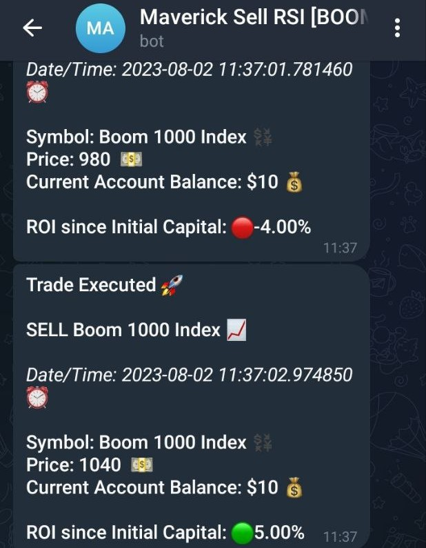

# Maverick RSI Strategy 🚀

<p align="center">
  
</p>

# Table of contents
- [Features ⚔️](#features-️)
- [Project Structure 🌳](#project-structure-)
- [Documentation 📚](#documentation-)
- [Obsolete 👎](#obsolete-)
- [Source 💦](#source-)
- [Disclaimer ☣️☣️☣️](#disclaimer-)
- [Strategy 💸](#strategy-)
- [Backtest ✅](#backtest-)
  - [Backtest Results 🔮](#backtest-results-)
- [Telegram Signal and Help 🧑🏿‍💻](#telegram-signal-and-help-)
  - [Telegram Bot Result (Example) 🤖](#telegram-bot-result-example-)
- [Requirements 📌](#requirements-)
- [How to Run the Program](#how-to-run-the-program)
- [Other Requirements 📌📌](#other-requirements-)
- [License ✒️](#license-)

# Features ⚔️

The Maverick RSI Strategy comes with various features to facilitate automated trading and backtesting. Below are the current features of the strategy and upcoming features planned for future updates:

## Current Features 📦

- [x] ⚡️ **RSI Sell Strategy**: The strategy is based on the Relative Strength Index (RSI) indicator and executes sell trades when specific RSI conditions are met.

- [x] ⚡️ **Automated Trading**: The strategy automatically monitors the market for sell trade opportunities and executes trades without manual intervention.

- [x] ⚡️ **Backtesting**: The `backtest.ipynb` Jupyter notebook allows you to perform backtesting using historical price data to evaluate the strategy's performance.

- [x] ⚡️ **Performance Visualization**: Backtest results are visualized with performance charts showcasing account balance and profit over time.

- [x] ⚡️ **Telegram Signal**: Receive Telegram messages with trade notifications when a sell trade is executed.

- [x] ⚡️ **Help Function**: The `help()` function provides a quick overview of how to run the program and set up the Telegram bot.

## Upcoming Features 📥

- [ ] 📣 **Buy Strategy**: Implementation of a buy strategy based on the RSI indicator to execute buy trades when specific conditions are met.

- [ ] 📣 **Addictional Telegram commands**: Increase the number of telegram commands eg: A command to know the total number of trades, profit for a giving date or period of time.

- [ ] 📣 **Improved Risk Management**: Enhanced risk management techniques to optimize trade size and minimize potential losses.

- [ ] 📣 **Interactive Configuration**: User-friendly interface for adjusting strategy parameters, such as RSI period and lot size.

- [ ] 📣 **Email Notifications**: Receive email notifications when a sell or buy trade is executed.

- [ ] 📣 **Advanced Performance Metrics**: Addition of advanced performance metrics, such as Sharpe ratio and drawdown analysis.

- [ ] 📣 **Real-Time Trading**: Integration with real-time data feeds for live trading.

- [ ] 📣 **Machine Learning Enhancements**: Application of machine learning techniques to enhance strategy performance and adaptability.

- [ ] 📣 **Reimplementation In C++**: Reimplementation of the strategy in C++ to enhance, speed and latency.

We are continuously working on improving the Maverick RSI Strategy to make it more robust, flexible, and user-friendly. Your feedback and contributions are highly valuable in shaping the future development of this project. If you have any suggestions or ideas for new features or improvements, feel free to open an [issue](https://github.com/AnalyticAce/Algorithmic-Trading-Projects/issues) on GitHub to discuss them. Stay tuned for updates and happy trading! 📈

# Project Structure 🌳

The project is organized into several directories:

- `Backtest`: Contains the Jupyter notebook `backtest.ipynb`, which performs backtesting on the Maverick RSI Strategy using historical data and showcases the results in the form of images.
- `Documentation`: Contains the Jupyter notebook `maverick.ipynb`, which provides detailed documentation and explanations for the Maverick RSI Strategy.
- `Obsolete`: Contains older versions of the strategy script (`maverick_rsi_v1.py` and `maverick_rsi_v2.py`) that are no longer in use.
- `Source`: Contains auxiliary files used in the project, including ASCII art, backtest result images, sounds, and the `requirements.txt` file.
- `Strategy`: Contains the main implementation of the Maverick RSI Strategy in the `maverick_v3.py` script, along with a `tools` directory that houses the `print_utils.py` module for improved code readability.

# Documentation 📚

The `Documentation` directory contains the `maverick.ipynb` Jupyter notebook, which serves as comprehensive documentation for the Maverick RSI Strategy. The notebook includes detailed explanations of the strategy's components, such as data retrieval, RSI calculation, and trade execution. It also provides insights into the trading logic and considerations for the strategy's implementation.

# Obsolete 👎

The `Obsolete` directory houses older versions of the strategy script that are no longer in use or have been superseded by newer versions. These scripts are preserved for

 historical reference and should not be utilized in the current implementation.

# Source 💦

The `Source` directory contains auxiliary files used in the project:

- `image`: Contains backtest result images, including `backtest.png` and `profit.png`.
- `son`: Contains sound files used for notifications, including `error.mp3` and `success.mp3`.
- `text`: Contains ASCII art used for decorative purposes in `ascii.txt` and the `requirements.txt` file listing the required Python packages and their versions to run the Maverick RSI Strategy. You can install these dependencies using `pip` with the command `pip install -r Source/text/requirements.txt`.

# Disclaimer ☣️☣️☣️

***DISCLAIMER: This project is for educational and informational purposes only and does not constitute financial advice. Trading and investing in financial markets involves substantial risk and is not suitable for everyone. The information provided in this project is based on historical data and past performance is not indicative of future results. The authors and contributors of this project are not financial advisors and shall not be held responsible for any financial losses or damages resulting from the use of this project. You should carefully consider your financial situation and consult with a qualified professional before making any investment decisions.***

# Strategy 💸

The `Strategy` directory is the core of the Maverick RSI Strategy:

- `maverick_v3.py`: This script contains the main implementation of the strategy. It retrieves historical price data, calculates the RSI indicator, and executes sell trades based on specific conditions.

- `tools/print_utils.py`: This module contains printing functions to enhance code readability. It separates all the printing statements from the main script for better organization.

- `tools/generate_data.ipynb`: This module contains data extration function to facilitate the extration of any financial asset listed on Metatrader5.

# Backtest ✅

The `Backtest` directory contains the `backtest.ipynb` Jupyter notebook, which performs backtesting on the Maverick RSI Strategy using historical price data stored in the `historical_data.csv` file. The notebook uses the `maverick_v3.py` script to execute the strategy and evaluates its performance based on the historical data. The results are displayed in the form of images, including a performance chart and a profit chart. The `backtest_v2.ipynb` file backest extra/other metrics of the strategy, the `telegram.py` simulate an example of the telegram messages that could be sent to the bot.

## Backtest Results 🔮

#### History of winning/lossing trades on last 1000 candles


#### Performance Chart


#### Profit Chart (With an Initial Capital of $10 on the last 1000 candles)


#### History of trades on last 1000 candles


# Telegram Signal and Help 🧑🏿‍💻

To receive Telegram messages when a trade is taken, run the following command:

```python
./Strategy/maverick_v3  --telegram
```

To set up the Telegram bot, follow these steps:

1. Search for the "BotFather" bot in the Telegram app.
2. Start a chat with the BotFather and use the command "/newbot" to create a new bot.
3. Follow the instructions to choose a name and username for your bot.
4. Once the bot is created, the BotFather will provide you with a token. Copy this token; you will need it later.
5. Create a new file named `secret.py` inside the `Strategy` directory.
6. Inside `secret.py`, define a class named `credentials` and add the following lines:

```python
class credentials:
    YOUR_TELEGRAM_TOKEN = "YOUR_TELEGRAM_API_KEY"
    CHAT_ID = "YOUR_CHAT_ID"
```

Replace `"YOUR_TELEGRAM_API_KEY"` with the token you obtained from the BotFather, and `"YOUR_CHAT_ID"` (To find `"YOUR_CHAT_ID"` search for the "userinfobot" bot in the Telegram app and get the necessary informations using "/start") with your Telegram Chat ID.
7. Save the changes to the `secret.py` file.

After setting up the Telegram bot and updating the `secret.py` file with your API key and Chat ID, you can run the Maverick RSI Strategy with Telegram notifications as explained in the "Usage" section.

To get help and see available commands, run:

```python
./Strategy/maverick_v3 --help
```

#### Telegram Bot Result (Example) 🤖


# Requirements 📌

The Maverick RSI Strategy requires the following Python packages:

- MetaTrader5==5.0.40
- pandas==1.3.3
- ta==0.7.0
- termcolor==1.1.0
- playsound
- telebot
- pyTelegramBotAPI

You can install these dependencies using `pip` with the command:
```python
pip install -r Source/text/requirements.txt
```

# How to Run the Program

Now that you followed the steps above and setup the necessary dependencies let run the program:

```python
./Strategy/maverick_v3 --run
```

# Other Requirements 📌📌

To set up the Maverick RSI Strategy and run it successfully, you need to ensure that you have the following software installed on your system:

1. **Python**: Python is the programming language used to develop the Maverick RSI Strategy. Make sure you have Python installed on your computer. You can download the latest version of Python from the official website: [https://www.python.org/downloads/](https://www.python.org/downloads/). After downloading, follow the installation instructions for your operating system.

2. **Visual Studio Code (VSCode)**: Visual Studio Code is an integrated development environment (IDE) that provides a powerful and user-friendly interface for coding Python scripts. You can download VSCode from the official website: [https://code.visualstudio.com/](https://code.visualstudio.com/). Once downloaded, install VSCode by following the installation instructions for your operating system.

3. **MetaTrader 5**: MetaTrader 5 is the trading platform used to retrieve historical price data and execute trades for the Maverick RSI Strategy. You can download MetaTrader 5 from the official MetaQuotes website: [https://www.metatrader5.com/en/download](https://www.metatrader5.com/en/download). After downloading, install MetaTrader 5 by following the installation instructions for your operating system.

4. **MetaTrader 5 Terminal and Account**: After installing MetaTrader 5, you need to open a trading account within the platform. This trading account will be used to access historical price data and execute trades. If you don't have a trading account, you can open a demo account for testing purposes. To do this, open MetaTrader 5, go to "File" > "Open an Account", and follow the instructions to create a new demo account.

Once you have Python, VSCode, and MetaTrader 5 installed and set up

## License ✒️

This project is licensed under the [MIT License](LICENSE). Feel free to modify and adapt the strategy according to your needs. However, please note that trading in financial markets involves risks, and the strategy's performance may vary depending on various factors. It is recommended to thoroughly test the strategy and exercise caution when using it for real trading. The authors of this project are not responsible for any financial losses incurred while using the strategy.

For detailed information on the implementation and usage of the Maverick RSI Strategy, please refer to the `maverick.ipynb` Jupyter notebook in the `Documentation` directory.

For any issues or suggestions, please feel free to open an [issue](https://github.com/AnalyticAce/Algorithmic-Trading-Projects/issues) on GitHub.

**Note:** Please replace "username/repo" with your actual GitHub repository URL.
